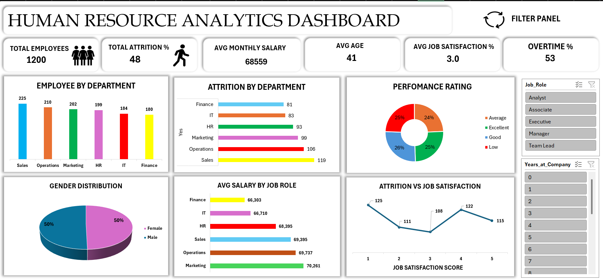

# 📊 Human Resource Analytics Dashboard (Excel Project)

## 📌 Project Overview
This project presents an interactive **Human Resource Analytics Dashboard** built using Microsoft Excel. The dashboard analyzes important HR metrics such as employee count, attrition rate, salary trends, job satisfaction, and overtime. It helps organizations understand workforce patterns and make better HR decisions through clear data visualization.

## 🎯 Objective
The goal of this project is to transform raw HR data into meaningful insights using Excel dashboards and visual analytics.

## 📊 Dashboard Features
- Total Employees KPI
- Attrition Percentage
- Average Monthly Salary
- Average Age of Employees
- Job Satisfaction Score
- Overtime Percentage

## 📈 Visualizations Included
- Employee Distribution by Department
- Attrition by Department
- Performance Rating Analysis
- Gender Distribution
- Average Salary by Job Role
- Attrition vs Job Satisfaction Trend

## 🎛 Interactive Filters
- Job Role Filter
- Years at Company Filter

These filters allow users to dynamically explore HR insights.

## 🛠 Tools Used
- Microsoft Excel
- Pivot Tables
- Pivot Charts
- Slicers
- Data Visualization

## 📷 Dashboard Preview


## 📂 Project Structure
```
HR-Analytics-Dashboard
│
├── HR_Analytics_Dashboard.xlsx
├── Dashboard view.png
└── README.md
```

## 🚀 Insights
- Sales department has the highest employee count.
- Attrition varies across departments.
- Job satisfaction has a visible relationship with attrition levels.
- Gender distribution is balanced in the organization.

## 👨‍💻 Author
**Muhammed Sinan**  
 Data Analyst | Excel Dashboard Developer
